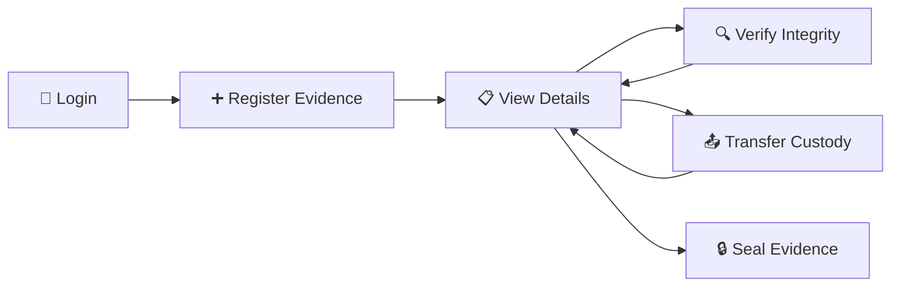
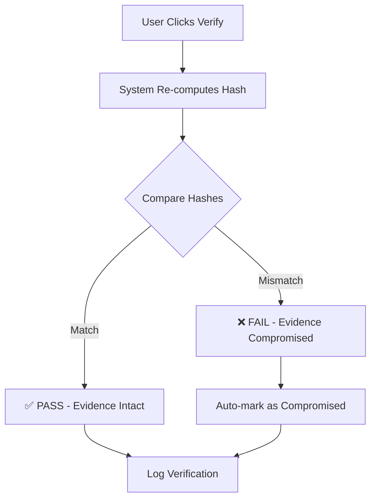
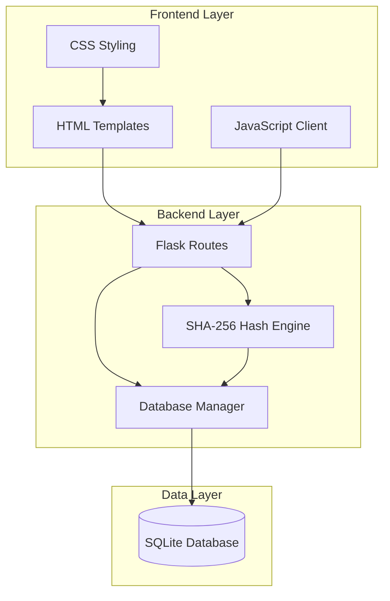

<div align="center">

# 🔐 Evidential

### *Chain of Custody Integrity Management*


A professional web application for managing digital evidence with **SHA-256 cryptographic integrity verification**. Built for digital forensics, legal proceedings, and secure evidence tracking.

[Features](#-features) • [Quick Start](#-quick-start) • [Usage](#-usage-guide) • [Security](#-security-features)

</div>

---

## 🎯 Features

| Feature | Description |
|---------|-------------|
| 🔒 **Cryptographic Integrity** | SHA-256 hash generation and automatic verification |
| 📋 **Chain of Custody** | Complete audit trail of all evidence handling |
| 👥 **Role-Based Access** | 5 distinct roles with granular permissions |
| ⚡ **Real-time Verification** | Instant integrity checking with tamper detection |
| 🎨 **Professional UI** | Dark cybersecurity-themed interface with neon accents |
| 📦 **Minimal Dependencies** | Python/Flask + SQLite — no external database needed |

## 🚀 Quick Start

> **Prerequisites**: Python 3.x installed on your system

```bash
# 1. Clone the repository
git clone https://github.com/TheWildEye/Evidential.git
cd Evidential

# 2. Install dependencies
pip install -r requirements.txt

# 3. Launch the application
python app.py

# 4. Open in browser
# http://127.0.0.1:5000
```

### 🔑 Demo Credentials

| Role | Username | Password |
|------|----------|----------|
| 👑 **System Admin** | `sysadmin` | `admin123` |
| 📁 **Evidence Manager** | `manager` | `manager123` |
| 🔍 **Investigator** | `investigator` | `inv123` |
| 📊 **Forensic Analyst** | `analyst` | `analyst123` |
| 📋 **Auditor** | `auditor` | `audit123` |

## 📖 Usage Guide

### Workflow



### Step-by-Step

1. **Login** — Navigate to `http://127.0.0.1:5000` and use demo credentials
2. **Register Evidence** — Click **"NEW EVIDENCE"**, fill in case number, description & type → system generates SHA-256 hash automatically
3. **View Details** — Click any evidence card to see metadata, hashes & full custody timeline
4. **Verify Integrity** — Click **"VERIFY INTEGRITY"** → system re-computes hash and compares with original (✅ PASS / ❌ FAIL)
5. **Transfer Custody** — Click **"TRANSFER CUSTODY"** → add notes, permanently logged with timestamp & hash status
6. **Seal Evidence** — Click **"SEAL EVIDENCE"** to mark read-only (⚠️ irreversible)

## 🔒 Security Features

### Integrity Verification Flow



- **SHA-256 Hashing** — Each evidence item gets a unique cryptographic fingerprint from its metadata. Even a single character change produces a completely different hash.
- **Chain of Custody Logging** — Every action (create, transfer, verify, seal) is permanently logged with who, when, what, and hash status.
- **Tamper Detection** — Automatic comparison of original vs current hash flags compromised evidence instantly.

## 🏗️ Architecture



### 📁 Project Structure

```
Evidential/
├── app.py                 # Flask application & API routes
├── database.py            # Database models & hash operations
├── requirements.txt       # Python dependencies
├── evidence.db            # SQLite database (auto-created)
├── templates/
│   ├── login.html         # Authentication page
│   ├── dashboard.html     # Evidence registry
│   └── evidence.html      # Evidence detail & custody timeline
└── static/
    ├── style.css           # Cybersecurity-themed CSS
    └── script.js           # Client-side interactions
```

---

<div align="center">

### 🎓 M.Tech Minor Project

**Built with** ❤️ **using Python, Flask & SHA-256**

[](https://github.com/TheWildEye/Evidential)
[](https://python.org)

</div>
