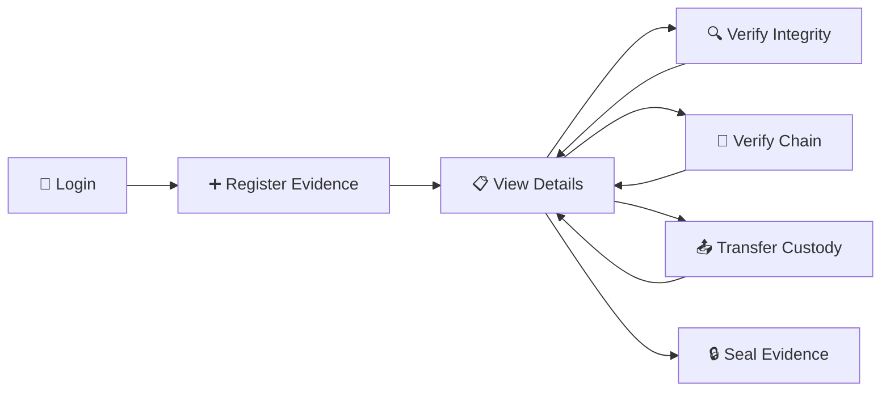
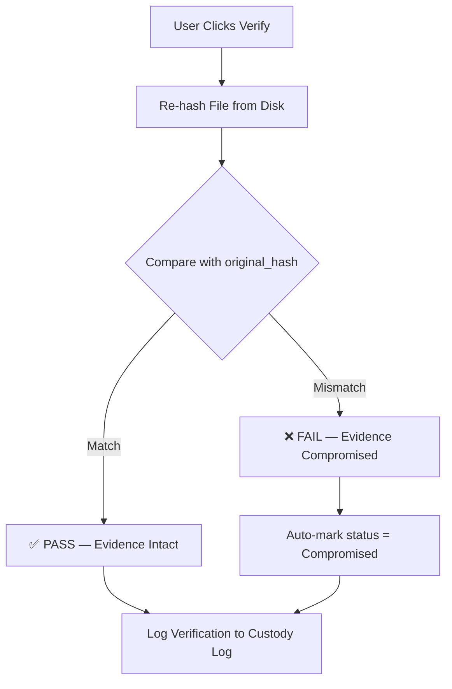
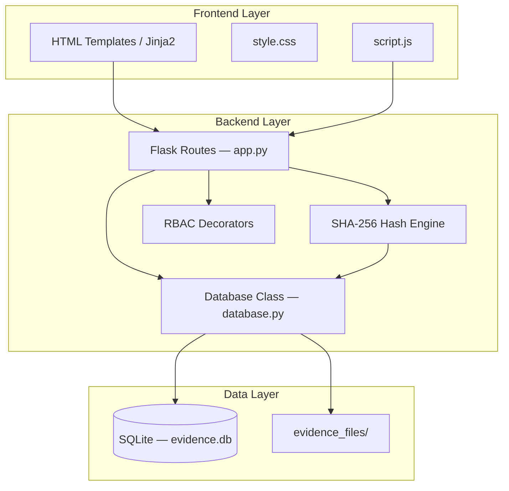

<div align="center">

# 🔐 Evidential

### *Chain of Custody Integrity Management*


A professional web application for managing digital evidence with **SHA-256 cryptographic integrity verification** and a **tamper-evident hash-chained audit log**. Built for digital forensics, legal proceedings, and secure evidence tracking.

[Features](#-features) • [Quick Start](#-quick-start) • [Usage](#-usage-guide) • [Security](#-security-features) • [Architecture](#️-architecture)

</div>

---

## 🎯 Features

| Feature | Description |
|---------|-------------|
| 🔒 **Cryptographic Integrity** | SHA-256 hash generation and automatic file-level verification |
| 📋 **Tamper-Evident Audit Log** | Hash-chained custody log — each entry links to the previous |
| 👥 **Role-Based Access Control** | 5 real-world roles with granular permissions |
| ⚡ **Real-time Verification** | Instant integrity and chain verification with tamper detection |
| 📁 **File Evidence Upload** | Attach actual files; hash computed from file bytes |
| 🎨 **Professional UI** | Dark cybersecurity-themed interface with neon accents |
| 📦 **Minimal Dependencies** | Python/Flask + SQLite — no external database needed |

## 🚀 Quick Start

> **Prerequisites**: Python 3.x installed on your system

```bash
# 1. Clone the repository
git clone https://github.com/TheWildEye/Evidential.git
cd Evidential

# 2. Install dependencies
pip install -r requirements.txt

# 3. Launch the application
python app.py

# 4. Open in browser
# http://127.0.0.1:5000
```

### 🔑 Demo Credentials

| Role | Username | Password |
|------|----------|----------|
| 👑 **System Admin** | `admin` | `admin123` |
| 🚔 **Field Officer** | `officer` | `officer123` |
| 🗄️ **Evidence Custodian** | `custodian` | `custody123` |
| 🔬 **Forensic Analyst** | `analyst` | `analyst123` |
| ⚖️ **Court Auditor** | `auditor` | `audit123` |

## 📖 Usage Guide

### Workflow


```mermaid
graph LR
    A[🔐 Login] --> B[➕ Register Evidence]
    B --> C[📋 View Details]
    C --> D[🔍 Verify Integrity]
    C --> E[🔗 Verify Chain]
    C --> F[📤 Transfer Custody]
    C --> G[🔒 Seal Evidence]
    D --> C
    E --> C
    F --> C
```

### Step-by-Step

1. **Login** — Navigate to `http://127.0.0.1:5000` and use demo credentials
2. **Dashboard** — System Admin and Court Auditor see **all** evidence; all other roles see only evidence currently **in their custody**
3. **Register Evidence** — Click **"NEW EVIDENCE"**, fill in case number, description & type, optionally attach a file → SHA-256 hash generated automatically
4. **View Details** — Click any evidence card to see metadata, hashes & full custody timeline
5. **Verify Integrity** — Click **"VERIFY INTEGRITY"** → system re-hashes file from disk and compares with original (✅ PASS / ❌ FAIL)
6. **Verify Chain** — Click **"VERIFY CHAIN"** → walks the entire log, validating every hash link (detects log tampering)
7. **Transfer Custody** — Click **"TRANSFER CUSTODY"** → add notes; permanently logged with timestamp, hash status & chain link
8. **Seal Evidence** — Click **"SEAL EVIDENCE"** to mark read-only (⚠️ irreversible)

## 🔒 Security Features

### Integrity Verification Flow


```mermaid
graph TD
    A[User Clicks Verify] --> B[Re-hash File from Disk]
    B --> C{Compare with original_hash}
    C -->|Match| D[✅ PASS — Evidence Intact]
    C -->|Mismatch| E[❌ FAIL — Evidence Compromised]
    E --> F[Auto-mark status = Compromised]
    D --> G[Log Verification to Custody Log]
    F --> G
```

- **SHA-256 File Hashing** — If a file is attached, its raw bytes are hashed. Without a file, hash is derived from metadata.
- **Hash-Chained Audit Log** — Every custody log entry stores `previous_hash` (the prior entry's chain hash) and its own `chain_hash = SHA-256(evidence_id|action|performer|timestamp|previous_hash|notes)`. The chain starts with a `GENESIS` sentinel.
- **Chain Verification** — The Verify Chain feature re-derives every hash in insertion order and checks linkage, detecting any silent modification to log entries.
- **Tamper Detection** — File-missing or hash-mismatch cases are automatically flagged and the evidence status is set to `Compromised`.

## 🏗️ Architecture


```mermaid
graph TB
    subgraph "Frontend Layer"
        A[HTML Templates / Jinja2]
        B[style.css]
        C[script.js]
    end

    subgraph "Backend Layer"
        D[Flask Routes — app.py]
        E[Database Class — database.py]
        F[SHA-256 Hash Engine]
        G[RBAC Decorators]
    end

    subgraph "Data Layer"
        H[(SQLite — evidence.db)]
        I[evidence_files/]
    end

    A --> D
    C --> D
    D --> G
    D --> E
    D --> F
    E --> H
    F --> E
    E --> I
```

### 📁 Project Structure

```
Evidential/
├── app.py                 # Flask application & API routes
├── database.py            # Database models, RBAC & hash engine
├── requirements.txt       # Python dependencies
├── pyrightconfig.json     # IDE type-checker config
├── evidence.db            # SQLite database (auto-created)
├── evidence_files/        # Uploaded evidence files (auto-created)
├── templates/
│   ├── login.html         # Authentication page
│   ├── dashboard.html     # Evidence registry
│   └── evidence.html      # Evidence detail & custody timeline
└── static/
    ├── style.css          # Cybersecurity-themed CSS
    └── script.js          # Client-side interactions
```

---

<div align="center">

⭐ **If you found this useful, star this repo!** ⭐

[](https://github.com/TheWildEye/Evidential/stargazers)
[](https://github.com/TheWildEye/Evidential)

**Made by [Vyom Nagpal](https://github.com/TheWildEye) — M.Tech Cybersecurity**

</div>
