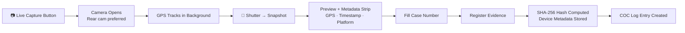
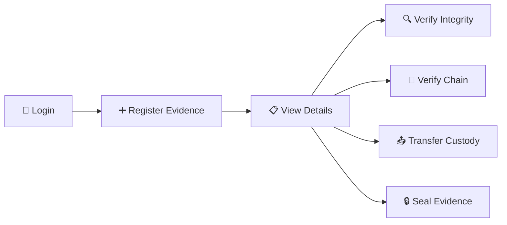
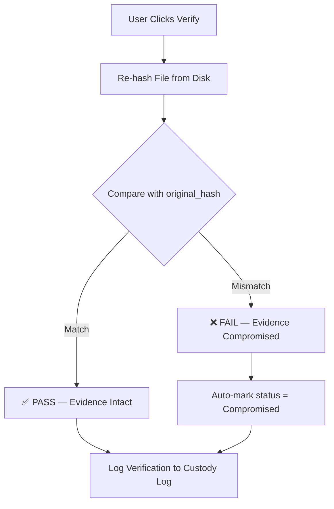
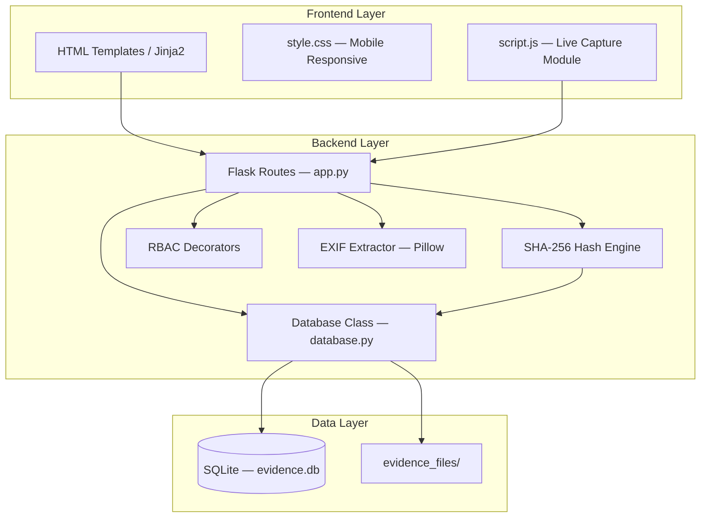

<div align="center">

# 🔐 Evidential

### *Chain of Custody Integrity Management*


A professional web application for managing digital evidence with **SHA-256 cryptographic integrity**, a **tamper-evident hash-chained audit log**, and a **mobile-first Live Evidence Capture** system with GPS and device metadata for full forensic Chain of Custody.

[Features](#-features) • [Quick Start](#-quick-start) • [Mobile Capture](#-mobile-live-evidence-capture) • [Security](#-security-features) • [Deploy](#-deployment) • [Architecture](#️-architecture)

</div>

---

## 🎯 Features

| Feature | Description |
|---------|-------------|
| 🔒 **Cryptographic Integrity** | SHA-256 hash generation and automatic file-level verification |
| 📋 **Tamper-Evident Audit Log** | Hash-chained custody log — each entry links to the previous |
| 👥 **Role-Based Access Control** | 5 real-world roles with granular permissions |
| ⚡ **Real-time Verification** | Instant integrity and chain verification with tamper detection |
| 📁 **File Evidence Upload** | Attach actual files up to 100MB; hash computed from raw file bytes |
| 📷 **Live Evidence Capture** | Capture photos directly from mobile browser with GPS + device metadata |
| 📍 **GPS Metadata** | Latitude, longitude, altitude, accuracy radius, and GPS timestamp |
| 📱 **EXIF Extraction** | Server-side extraction of camera Make/Model, focal length, ISO, embedded GPS |
| 🌐 **Device Context** | Browser platform, screen resolution, network type, timezone, CPU/RAM info |
| 📱 **Mobile Responsive** | Full mobile UI with slide-up modals, stacked layouts, and no horizontal scroll |
| 🎨 **Professional UI** | Dark cybersecurity-themed interface with neon accents |
| 📦 **Minimal Dependencies** | Python/Flask + SQLite + Pillow — no external database needed |

---

## 🚀 Quick Start

> **Prerequisites**: Python 3.x installed on your system

```bash
# 1. Clone the repository
git clone https://github.com/TheWildEye/Evidential.git
cd Evidential

# 2. Install dependencies
pip install -r requirements.txt

# 3. Launch the application
python app.py

# 4. Open in browser
# Local:  http://127.0.0.1:5000
# Mobile: http://YOUR_LOCAL_IP:5000  (must be on same WiFi)
```

### 🔑 Demo Credentials

| Role | Username | Password |
|------|----------|----------|
| 👑 **System Admin** | `admin` | `admin123` |
| 🚔 **Field Officer** | `officer` | `officer123` |
| 🗄️ **Evidence Custodian** | `custodian` | `custody123` |
| 🔬 **Forensic Analyst** | `analyst` | `analyst123` |
| ⚖️ **Court Auditor** | `auditor` | `audit123` |

---

## 📷 Mobile Live Evidence Capture

Open the app on any mobile browser and tap **📷 Live Capture** on the dashboard.

### What it captures

| Layer | Data |
|-------|------|
| **Browser / Device** | User-agent, platform, screen resolution, CPU cores, RAM, language |
| **Network** | Connection type (4G/WiFi/etc.), effective type |
| **GPS** | Latitude, longitude, altitude, accuracy radius (±m), heading, speed, GPS timestamp |
| **Timezone** | Local timezone + ISO 8601 capture timestamp |
| **EXIF (from image)** | Camera Make & Model, Software/OS, DateTimeOriginal, focal length, ISO, exposure, embedded GPS |

### Capture flow


```mermaid
graph LR
    A[📷 Live Capture Button] --> B[Camera Opens\nRear cam preferred]
    B --> C[GPS Tracks in Background]
    C --> D[🔴 Shutter → Snapshot]
    D --> E[Preview + Metadata Strip\nGPS · Timestamp · Platform]
    E --> F[Fill Case Number]
    F --> G[Register Evidence]
    G --> H[SHA-256 Hash Computed\nDevice Metadata Stored]
    H --> I[COC Log Entry Created]
```

> **Note:** For accurate GPS, the app must be served over **HTTPS**. On plain HTTP (local network), browsers fall back to WiFi/IP geolocation. Deploy to Railway or PythonAnywhere for real GPS access.

### Camera fallback
If camera access is denied, the overlay shows a **📁 Pick Photo from Gallery** option — evidence can always be submitted even without camera permission. GPS is always **optional** and never blocks image capture.

---

## 📖 Usage Guide

### Standard Workflow


```mermaid
graph LR
    A[🔐 Login] --> B[➕ Register Evidence]
    B --> C[📋 View Details]
    C --> D[🔍 Verify Integrity]
    C --> E[🔗 Verify Chain]
    C --> F[📤 Transfer Custody]
    C --> G[🔒 Seal Evidence]
```

1. **Login** — Use demo credentials at the root URL
2. **Dashboard** — Admin/Auditor see all evidence; other roles see only evidence in their custody
3. **Register Evidence** — Fill case number, description & type, optionally attach a file → SHA-256 hash auto-generated
4. **Live Capture** — On mobile, tap **📷 Live Capture** → camera opens → GPS starts → take snapshot → fill details → submit
5. **View Details** — Click any evidence card to see metadata, hashes, device capture info & full custody timeline
6. **Verify Integrity** — System re-hashes file from disk and compares with original (✅ PASS / ❌ FAIL)
7. **Verify Chain** — Walks the entire log, validating every hash link (detects log tampering)
8. **Transfer Custody** — Add notes; permanently logged with timestamp, hash status & chain link
9. **Seal Evidence** — Mark read-only ⚠️ (irreversible)

---

## 🔒 Security Features

### Integrity Verification Flow


```mermaid
graph TD
    A[User Clicks Verify] --> B[Re-hash File from Disk]
    B --> C{Compare with original_hash}
    C -->|Match| D[✅ PASS — Evidence Intact]
    C -->|Mismatch| E[❌ FAIL — Evidence Compromised]
    E --> F[Auto-mark status = Compromised]
    D --> G[Log Verification to Custody Log]
    F --> G
```

- **SHA-256 File Hashing** — Raw file bytes are hashed. Without a file, hash is derived from metadata.
- **Hash-Chained Audit Log** — Every custody entry stores `previous_hash` + `chain_hash = SHA-256(evidence_id|action|performer|timestamp|previous_hash|notes)`. Chain starts at `GENESIS`.
- **Chain Verification** — Re-derives every hash in insertion order and checks linkage, detecting any silent modification.
- **Tamper Detection** — File-missing or hash-mismatch cases are flagged and evidence status set to `Compromised`.
- **Device Metadata Integrity** — All captured device/GPS metadata is stored as a JSON blob alongside the evidence hash for forensic audit.
- **Secure Secret Key** — `FLASK_SECRET_KEY` loaded from environment variable; never hardcoded.
- **Upload Limit** — 100MB max per upload to prevent DoS.

---

## ☁️ Deployment

### Railway (Recommended — Persistent + Easy)

```bash
# 1. Push to GitHub (already done)
# 2. Go to railway.app → New Project → Deploy from GitHub
# 3. Set env variable: FLASK_SECRET_KEY = your_secret_here
# 4. Settings → Networking → Generate Domain → get https:// URL
```

### PythonAnywhere (Free Forever)

```bash
# In PythonAnywhere Bash console:
git clone https://github.com/TheWildEye/Evidential.git
pip install --user -r requirements.txt
# Then configure Web App → WSGI file → point to app.py
```

> Both platforms provide automatic HTTPS which is required for GPS and camera access on mobile browsers.

---

## 🏗️ Architecture


```mermaid
graph TB
    subgraph "Frontend Layer"
        A[HTML Templates / Jinja2]
        B[style.css — Mobile Responsive]
        C[script.js — Live Capture Module]
    end

    subgraph "Backend Layer"
        D[Flask Routes — app.py]
        E[Database Class — database.py]
        F[SHA-256 Hash Engine]
        G[RBAC Decorators]
        H[EXIF Extractor — Pillow]
    end

    subgraph "Data Layer"
        I[(SQLite — evidence.db)]
        J[evidence_files/]
    end

    A --> D
    C --> D
    D --> G
    D --> E
    D --> F
    D --> H
    E --> I
    F --> E
    E --> J
```

### 📁 Project Structure

```
Evidential/
├── app.py                 # Flask application, API routes & EXIF extractor
├── database.py            # Database models, RBAC, hash engine & device_metadata column
├── requirements.txt       # Python dependencies (Flask, Werkzeug, Pillow, gunicorn)
├── Procfile               # Production server config (gunicorn)
├── evidence.db            # SQLite database (auto-created on first run)
├── evidence_files/        # Uploaded & captured evidence files (auto-created)
├── templates/
│   ├── login.html         # Authentication page
│   ├── dashboard.html     # Evidence registry + Live Capture modal
│   └── evidence.html      # Evidence detail, custody timeline & device metadata
└── static/
    ├── style.css          # Cybersecurity-themed CSS + mobile breakpoints
    └── script.js          # Live Capture module: camera, GPS, metadata, submit
```

---

<div align="center">

⭐ **If you found this useful, star this repo!** ⭐

[](https://github.com/TheWildEye/Evidential/stargazers)
[](https://github.com/TheWildEye/Evidential)

**Made by [Vyom Nagpal](https://github.com/TheWildEye) — M.Tech Cybersecurity**

</div>
