```mermaid
graph TD
    A[User Clicks Verify] --> B[System Re-computes Hash]
    B --> C{Compare Hashes}
    C -->|Match| D[✅ PASS - Evidence Intact]
    C -->|Mismatch| E[❌ FAIL - Evidence Compromised]
    E --> F[Auto-mark as Compromised]
    D --> G[Log Verification]
    F --> G
```

<div align="center">

# 🔐 Chain of Custody Evidence Management System

### *Cryptographic Integrity Verification for Digital Forensics*


A professional B2B SaaS web application for managing digital evidence with **SHA-256 cryptographic integrity verification**. Built for digital forensics, legal proceedings, and secure evidence tracking.

[Features](#-features) • [Quick Start](#-quick-start) • [Usage](#-usage-guide) • [Security](#-security-features) • [Documentation](#-technical-documentation)

</div>

---

## 🎯 Features

| Feature | Description |
|---------|-------------|
| 🔒 **Cryptographic Integrity** | SHA-256 hash generation and automatic verification |
| 📋 **Chain of Custody** | Complete audit trail of all evidence handling |
| 👥 **Secure Authentication** | Role-based access control with 5 distinct roles |
| ⚡ **Real-time Verification** | Instant integrity checking with tamper detection |
| 🎨 **Professional UI** | Dark cybersecurity-themed interface with neon accents |
| 📦 **Minimal Dependencies** | Simple Python/Flask stack, SQLite (no external database!) |

## 🛠️ Technical Stack

```
Backend:   Python 3.x + Flask
Database:  SQLite (single-file, portable)
Frontend:  HTML5 + CSS3 + Vanilla JavaScript
Security:  SHA-256 Cryptographic Hashing
```

## 🚀 Quick Start

### 📥 Installation

> **Prerequisites**: Python 3.x installed on your system

**Step 1:** Clone or download this repository

**Step 2:** Install dependencies
```bash
pip install -r requirements.txt
```

**Step 3:** Launch the application
```bash
python app.py
```

**Step 4:** Access the system
```
🌐 Open your browser: http://127.0.0.1:5000
```

### 🔑 Demo Credentials

| Role | Username | Password | Access Level |
|------|----------|----------|--------------|
| 👑 **System Admin** | `sysadmin` | `admin123` | Full access + user management |
| 📁 **Evidence Manager** | `manager` | `manager123` | Create, transfer, seal evidence |
| 🔍 **Investigator** | `investigator` | `inv123` | Create & transfer evidence |
| 📊 **Forensic Analyst** | `analyst` | `analyst123` | View & verify integrity |
| 📋 **Auditor** | `auditor` | `audit123` | Read-only + full audit trail |

## 📖 Usage Guide

### Complete Workflow

```mermaid
graph LR
    A[🔐 Login] --> B[➕ Register Evidence]
    B --> C[📋 View Details]
    C --> D[🔍 Verify Integrity]
    C --> E[📤 Transfer Custody]
    C --> F[🔒 Seal Evidence]
    D --> C
    E --> C
```



### Step-by-Step Guide

#### 1️⃣ **Login to System**
- Navigate to `http://127.0.0.1:5000`
- Use any demo credentials from the table above
- System authenticates and redirects to dashboard

#### 2️⃣ **Register New Evidence**
1. Click **"NEW EVIDENCE"** button on dashboard
2. Fill in the registration form:
   - **Case Number**: Unique identifier (e.g., `CASE-2026-001`)
   - **Description**: Brief description of evidence
   - **Evidence Type**: Select from dropdown (Digital, Physical, Document, etc.)
3. Click **"REGISTER"**
4. System automatically generates **SHA-256 hash** for integrity verification
5. Evidence appears on dashboard with "Active" status

#### 3️⃣ **View Evidence Details**
- Click on any evidence card in the dashboard
- View complete information:
  - Evidence metadata (case number, type, description)
  - **Original vs Current Hash** (cryptographic fingerprint)
  - Full **Chain of Custody Timeline** (all actions logged)

#### 4️⃣ **Verify Integrity**
- Click **"VERIFY INTEGRITY"** button
- System re-computes hash from current evidence data
- Compares with original hash:
  - ✅ **PASS**: Evidence untampered
  - ❌ **FAIL**: Evidence potentially compromised
- Verification logged in custody timeline

#### 5️⃣ **Transfer Custody**
- Click **"TRANSFER CUSTODY"**
- Add transfer notes (recipient, reason, location, etc.)
- Transfer is permanently logged with:
  - Timestamp
  - Performing user
  - Hash verification status

#### 6️⃣ **Seal Evidence**
- Click **"SEAL EVIDENCE"** to mark as read-only
- Prevents further modifications
- Typically done before legal proceedings
- ⚠️ **This action cannot be undone**

## 🔒 Security Features

### 🔐 Cryptographic Hashing (SHA-256)

Each piece of evidence gets a **unique 256-bit cryptographic hash** generated from:

```python
# Hash Input Formula
hash_data = f"{case_number}|{description}|{evidence_type}|{timestamp}"
evidence_hash = SHA256(hash_data)
```

**Example Hash Output:**
```
a3d5f7b2c8e1f4a9b6c3d7e2f5a8b1c4d6e9f2a5b8c1d4e7f0a3b6c9d2e5f8a1
```

> 💡 **How it works**: This hash serves as a **digital fingerprint**. Even a single character change in the evidence data produces a completely different hash, making tampering instantly detectable.

### 📋 Chain of Custody Logging

Every action is permanently logged with:

| Field | Description |
|-------|-------------|
| **WHO** | Username of person performing action |
| **WHEN** | Exact timestamp (ISO 8601 format) |
| **WHAT** | Action type (Created, Transferred, Verified, Sealed) |
| **HASH** | Pass/Fail status of integrity check at that moment |
| **NOTES** | Optional contextual information |

**Example Timeline Entry:**
```
Action:    Transferred
User:      investigator
Timestamp: 2026-02-13T00:45:32
Hash:      PASS ✓
Notes:     Transferred to forensics lab for analysis
```

### ✅ Integrity Verification



**Verification Process:**
1. System re-computes hash from current evidence data
2. Compares with original hash stored at registration
3. **Match** → Evidence integrity verified ✅
4. **Mismatch** → Evidence automatically flagged as **COMPROMISED** ❌
5. Result logged in chain of custody timeline

## 🏗️ Technical Documentation

### System Architecture


### Database Schema

```sql
-- Users Table
CREATE TABLE users (
    id INTEGER PRIMARY KEY,
    username TEXT UNIQUE NOT NULL,
    password_hash TEXT NOT NULL,
    role TEXT NOT NULL
);

-- Evidence Table
CREATE TABLE evidence (
    id INTEGER PRIMARY KEY,
    case_number TEXT NOT NULL,
    description TEXT NOT NULL,
    evidence_type TEXT NOT NULL,
    original_hash TEXT NOT NULL,      -- Hash at creation
    current_hash TEXT NOT NULL,       -- Hash for verification
    status TEXT NOT NULL,             -- Active, Sealed, Compromised
    created_at TEXT NOT NULL,
    created_by TEXT NOT NULL
);

-- Custody Log Table
CREATE TABLE custody_log (
    id INTEGER PRIMARY KEY,
    evidence_id INTEGER NOT NULL,
    action TEXT NOT NULL,             -- Created, Transferred, Verified, Sealed
    performed_by TEXT NOT NULL,
    timestamp TEXT NOT NULL,
    hash_verified TEXT,               -- PASS or FAIL
    notes TEXT,
    FOREIGN KEY (evidence_id) REFERENCES evidence (id)
);
```

### 📁 Project Structure

```
min8/
├── 📄 app.py                 # Main Flask application & API routes
├── 📄 database.py            # Database models & hash operations
├── 📄 requirements.txt       # Python dependencies (Flask, Werkzeug)
├── 📄 README.md             # This documentation
├── 📄 evidence.db           # SQLite database (auto-created)
│
├── 📁 templates/            # Jinja2 HTML templates
│   ├── login.html           # Authentication page
│   ├── dashboard.html       # Evidence registry
│   └── evidence.html        # Evidence detail & custody timeline
│
└── 📁 static/               # Static assets
    ├── style.css            # Cybersecurity-themed CSS
    └── script.js            # Client-side interactions
```

### API Endpoints

| Method | Endpoint | Description |
|--------|----------|-------------|
| `GET` | `/` | Redirect to dashboard or login |
| `POST` | `/login` | Authenticate user |
| `GET` | `/dashboard` | View all evidence |
| `GET` | `/evidence/<id>` | View evidence detail |
| `POST` | `/api/evidence/create` | Register new evidence |
| `POST` | `/api/evidence/<id>/transfer` | Transfer custody |
| `POST` | `/api/evidence/<id>/verify` | Verify integrity |
| `POST` | `/api/evidence/<id>/seal` | Seal evidence |

## 🎓 For Academic Presentation (M.Tech Minor Project)

### 📚 Learning Objectives Demonstrated

| Concept | Implementation | Academic Value |
|---------|----------------|----------------|
| **Cryptography** | SHA-256 hashing for integrity | Understanding practical cryptographic applications |
| **Digital Forensics** | Chain of custody tracking | Real-world evidence handling procedures |
| **Security** | Authentication + Audit trails | Defense against tampering and unauthorized access |
| **Software Engineering** | Clean MVC architecture | Professional code organization |
| **Full-Stack Dev** | Python/Flask + HTML/CSS/JS | Complete web application development |

### 💡 Key Concepts Explained

#### What is Chain of Custody?

> **Definition**: A chronological documentation showing the **seizure, custody, control, transfer, and disposition** of evidence.

**Why it matters:**
- 🏛️ **Legal Requirement**: Courts require proof evidence hasn't been tampered with
- 🔍 **Traceability**: Every person who handled evidence is recorded
- ✅ **Integrity**: Cryptographic proof evidence remains unchanged
- 📋 **Accountability**: Creates permanent audit trail

#### Why SHA-256?

```
Input:  "CASE-2026-001|Laptop hard drive|Digital|2026-02-13T00:30:00"
Output: a3d5f7b2c8e1f4a9b6c3d7e2f5a8b1c4d6e9f2a5b8c1d4e7f0a3b6c9d2e5f8a1

Change ONE character...
Input:  "CASE-2026-001|Laptop hard drive|Digital|2026-02-13T00:30:01"
Output: 7f2c4e9a1b8d5f3c6e0a4d7b2f5c8e1a4b7d0f3c6e9a2d5b8f1c4e7a0d3b6f9
         ^^^^ Completely different! ^^^^
```

**Properties:**
- ✅ **Deterministic**: Same input always produces same hash
- ✅ **One-way**: Cannot reverse hash to get original data
- ✅ **Collision-resistant**: Virtually impossible to find two inputs with same hash
- ✅ **Avalanche effect**: Tiny change in input creates completely different hash

### 🎯 Presentation Talking Points

1. **Problem Statement**: Need for tamper-proof evidence tracking in digital forensics
2. **Solution**: Web-based system with cryptographic integrity verification
3. **Innovation**: Automated hash generation + real-time verification
4. **Demo Flow**: Register → Transfer → Verify → Seal
5. **Technical Depth**: SHA-256, SQLite, RESTful API, MVC architecture
6. **Real-world Application**: Applicable to law enforcement, legal firms, corporate security

## 🔧 Customization

Add more evidence types in `templates/dashboard.html`:
```html
<option value="YourType">Your Type</option>
```

Modify hash algorithm in `database.py`:
```python
# Current: SHA-256
hashlib.sha256(data.encode()).hexdigest()

# Alternative: SHA-512
hashlib.sha512(data.encode()).hexdigest()
```

## 🔧 Customization & Extensions

### Adding New Evidence Types

Edit `templates/dashboard.html`:
```html
<select id="evidence_type" required>
    <option value="Digital">Digital</option>
    <option value="Physical">Physical</option>
    <option value="DNA">DNA Sample</option>        <!-- New type -->
    <option value="Multimedia">Multimedia</option> <!-- New type -->
</select>
```

### Using Different Hash Algorithm

Edit `database.py`:
```python
# Current: SHA-256
hashlib.sha256(data.encode()).hexdigest()

# Alternative: SHA-512 (more secure, longer hash)
hashlib.sha512(data.encode()).hexdigest()

# Alternative: SHA3-256 (latest standard)
hashlib.sha3_256(data.encode()).hexdigest()
```

---

## 📝 Quick Reference

```bash
# Install dependencies
pip install -r requirements.txt

# Run application
python app.py

# Access application
http://127.0.0.1:5000

# Default credentials (use any of the 5 roles)
sysadmin / admin123
```

---

## 📄 License

```
Academic Project - M.Tech Minor Project
Free to use and modify for educational purposes
```

## 🤝 Contributing

This is a student project, but:
- 🐛 Bug reports are welcome
- 💡 Feature suggestions appreciated
- 🔧 Pull requests accepted

---

<div align="center">

### 🎓 M.Tech Minor Project
### Chain of Custody & Cryptographic Integrity

**Built with** ❤️ **using Python, Flask & SHA-256**

[](https://github.com)
[](https://python.org)

</div>
